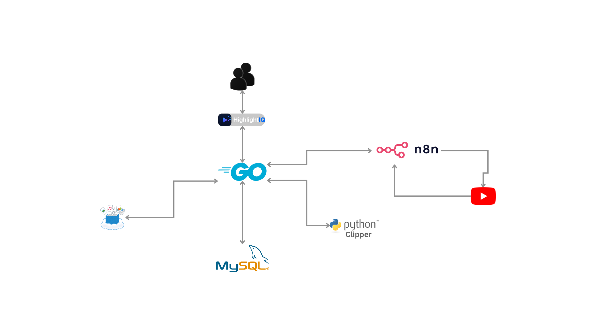
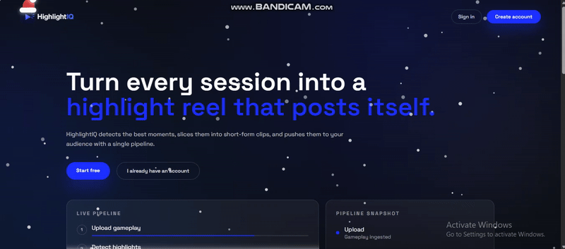
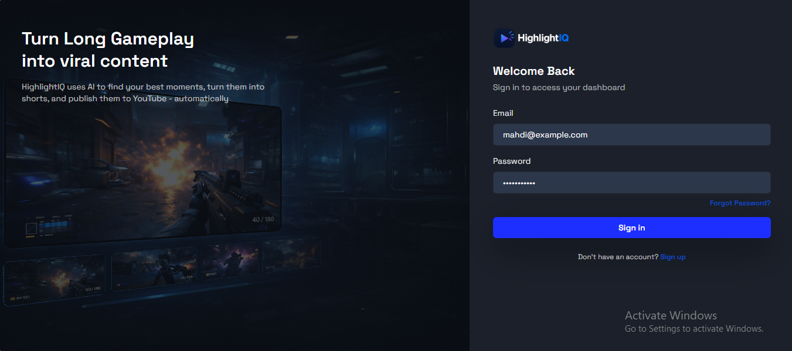
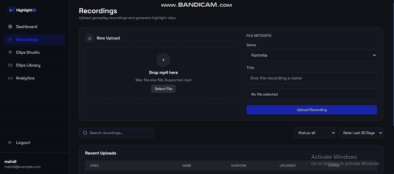
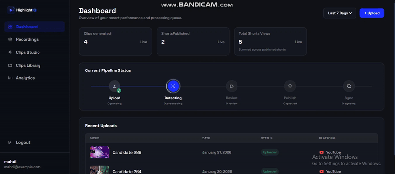
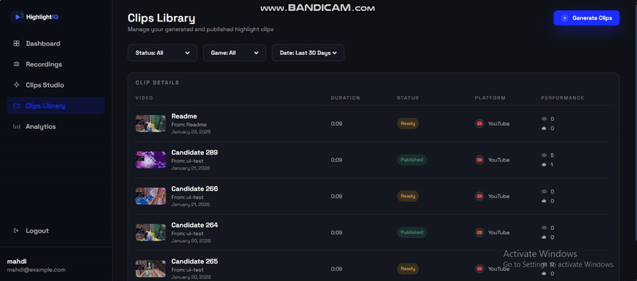
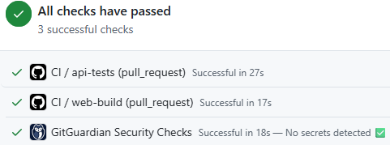
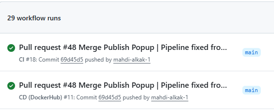
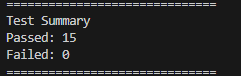

  

HighlightIQ is a platform that turns long gameplay recordings into short, shareable highlight clips. Its goal is to help creators save time by automating detection, review, and publishing of the best moments.
  

### <a href="#System-Workflow">System Workflow</a>

 

Database

 

n8n Workflow
 

  

### <a href="#interesting-features">Interesting Features</a>

- Clip candidate generation: adjustable detection settings for better highlights.
- Clip Studio editor: trim controls with publish gating.
- YouTube publishing: direct publish via workflow automation.
- Pipeline status: real-time stage tracking inside the dashboard.
- Libraries: recordings and clips with filters, pagination, and performance stats.
 

  

### <a href="#user-screens">User Screens</a>

<table>
  <tr>
    <th align="center">Landing</th>
    <th align="center">Register</th>
  </tr>
  <tr>
    <td align="center"></td>
    <td align="center"></td>
  </tr>

  <tr>
    <th align="center">Login</th>
    <th align="center">Uploading Video</th>
  </tr>
  <tr>
    <td align="center"></td>
    <td align="center"></td>
  </tr>

  <tr>
    <th align="center">Pipeline Kill Detection</th>
    <th align="center">Clip Candidate</th>
  </tr>
  <tr>
    <td align="center"></td>
    <td align="center"></td>
  </tr>

  <tr>
    <th align="center">Pipeline Review</th>
    <th align="center">Publish YouTube</th>
  </tr>
  <tr>
    <td align="center"></td>
    <td align="center"></td>
  </tr>

  <tr>
    <th align="center" colspan="2">Clips Library</th>
  </tr>
  <tr>
    <td align="center" colspan="2"></td>
  </tr>
</table>

  

### <a href="#Tests">Tests</a>

<table>
  <tr>
    <th align="center">CI/CD</th>
    <th align="center">Workflows</th>
  </tr>
  <tr>
    <td align="center">
      
    </td>
    <td align="center">
      
    </td>
  </tr>
  <tr>
      <th align="center">Tests</th>
  </tr>
  <tr>
    <td align="center">
      
    </td>
  </tr>
</table>
